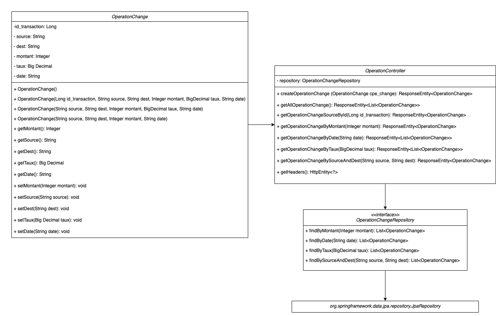

# Microservices - Operation Change

## Presentation
Gerer les operations de change. Une opération de change se caractérise par {"id transaction": 12345, "devise source": "EUR", "devise destination": "USD",
"montant": 1000, "date": "2021-05-25", "taux": 1.22, "counterpart": "Antoine Perrin"} signifiant qu'en date du 25 mai 2021, une opération de change, identifiée par le numéro 12345, de 1000 euros
en dollard US a été réalisée au taux EUR/USD = 1.22 par la contrepartie Antoine Perrin.
Il est possible grâce a ce microservice de publier, requêter, modifier ou bien encore supprimer des opérations de change.

## Diagramme de classe



# Installation
## Set up the Spring Boot Application
```bash
./mvnw package && java -jar target/operationchange
```
## Set up Docker
```bash
docker build -t springio/operationchange .
docker run -p 8080:8080 -t springio/operationchange
```
## Methods

| Methods   | Urls                                                                                  | Actions                                                                           |
| :--------:|:--------------------------------------------------------------------------------------| :---------------------------------------------------------------------------------|
| POST      | /operation-change                                                                     | create new Operation Change                                                       |
| GET       | /operation-change                                                                     | retrieve all Operation Change                                                     |
| GET       | /operation-change/id/{id_transaction}                                                 | retrieve Operation Change by {id_transaction}                                     |
| GET       | /operation-change/montant/{montant}                                                   | retrieve Operation Change by {montant}                                            |
| GET       | /operation-change/date/{date}                                                         | retrieve Operation Change by {date}                                               |
| GET       | /operation-change/taux/{taux}                                                         | retrieve Operation Change by {taux}                                               |
| GET       | /operation-change/source/{source}/dest/{dest}                                         | retrieve Operation Change by {source} and {dest}                                  |
| GET       | /operation-change/source/{source}/dest/{dest}/date/{date}                             | retrieve Operation Change by {source} and {dest} and {date}                       |
| GET       | /operation-change/counterpart/{counterpart}                                           | retrieve Operation Change by {counterpart}                                        |
| GET       | /operation-change/counterpart/{counterpart}/source/{source}/dest/{dest}               | retrieve Operation Change by {counterpart} by {source} and {dest}                 |
| GET       | /operation-change/counterpart/{counterpart}/date/{date}retrieve                       | retrieve Operation Change by {counterpart} by {date}                              |
| GET       | /operation-change/counterpart/{counterpart}/source/{source}/dest/{dest}/date/{date}   | retrieve Operation Change by {counterpart} by {source} by {dest} and {date}       |
| DELETE    | /operation-change/id/{id}                                                             | delete Operation Change by {id}                                                   |
| PUT       | /operation-change/id/{id}/taux/{taux}                                                 | update Operation Change by {id}                                                   |
| PUT       | /operation-change/id/{id}/taux/{taux}                                                 | update Operation Change {taux} by {id}                                            |
| PUT       | /operation-change/id/{id}/counterpart/{counterpart}                                   | update Operation Change {counterpart} by {id}                                     |
| PUT       | /operation-change/id/{id}/montant/{montant}                                           | update Operation Change {montant} by {id}                                         |
| PUT       | /operation-change/id/{id}/date/{date}                                                 | update Operation {date} Change by {id}                                            |


# Exemple
#### Opération type comportant les caracteristiques suivantes:
#### L'opération a lieu le 20/06, elle concerne la paire de devise EUR/USD, qui traite ce jour à 1.2234,
#### la contrepartie est la banque radin pour un montant de 1 000 €.

## POST
### create new Operation Change
```bash
curl -X POST -H "Content-type: application/json" -d "{\"source\" : \"EUR\", \"dest\" : \"USD\", \"taux\" : 1.2234, \"montant\" : 1000, \"date\": \"2021-06-20\", \"counterpart\": \"Banque_Radin\"}" "http://localhost:8080/operation-change" | python -m json.tool
```
```yaml
{
  "counterpart": "Banque_Radin",
  "date": "2021-06-20",
  "dest": "USD",
  "id": 1244,
  "montant": 1000,
  "source": "EUR",
  "taux": 1.2234
}
 ```
## GET
### retrieve all Operation Change
```bash
curl -X GET "http://localhost:8080/operation-change"  | python -m json.tool
```
```yaml
[
  {
    "counterpart": "Antoine_Perrin",
    "date": "2021-06-24",
    "dest": "USD",
    "id": 1237,
    "montant": 800,
    "source": "EUR",
    "taux": 1.19
  },
  {
    "counterpart": "Enri_Aycart",
    "date": "2021-06-23",
    "dest": "JPY",
    "id": 1238,
    "montant": 200,
    "source": "EUR",
    "taux": 132.3
  },
    ......
      
    ......
  {
    "counterpart": "Banque_Radin",
    "date": "2021-06-20",
    "dest": "USD",
    "id": 1244,
    "montant": 1000,
    "source": "EUR",
    "taux": 1.2234
  }
]

```
### retrieve Operation Change by {id_transaction}
```bash
curl -X GET "http://localhost:8080/operation-change/id/1244"  | python -m json.tool
```
```yaml
{
    "counterpart": "Banque_Radin",
    "date": "2021-06-20",
    "dest": "USD",
    "id": 1244,
    "montant": 1000,
    "source": "EUR",
    "taux": 1.2234
}
```

### retrieve Operation Change by {montant}
```bash
curl -X GET "http://localhost:8080/operation-change/montant/1000"  | python -m json.tool
```
```yaml
[
    {
        "counterpart": "Banque_Radin",
        "date": "2021-06-20",
        "dest": "USD",
        "id": 1244,
        "montant": 1000,
        "source": "EUR",
        "taux": 1.2234
    },
    ....
    {
        "counterpart": "JP_Aycart",
        "date": "2021-06-22",
        "dest": "JPY",
        "id": 1243,
        "montant": 1000,
        "source": "EUR",
        "taux": 132.08
    }
]

```
### retrieve Operation Change by {date}
```bash
curl -X GET "http://localhost:8080/operation-change/date/2021-06-20"  | python -m json.tool
```
```yaml
[
    {
        "counterpart": "Banque_Radin",
        "date": "2021-06-20",
        "dest": "USD",
        "id": 1244,
        "montant": 1000000,
        "source": "EUR",
        "taux": 1.2234
    }
]
```
### retrieve Operation Change by {taux}
```bash
curl -X GET "http://localhost:8080/operation-change/taux/1.2234"  | python -m json.tool
```
```yaml
[
    {
        "counterpart": "Banque_Radin",
        "date": "2021-06-20",
        "dest": "USD",
        "id": 1244,
        "montant": 1000000,
        "source": "EUR",
        "taux": 1.2234
    }
]

```
### retrieve Operation Change by {source} and {dest}
```bash
curl -X GET "http://localhost:8080/operation-change/source/EUR/dest/USD"  | python -m json.tool
```
```yaml
[
    {
        "counterpart": "HSBC",
        "date": "2021-06-21",
        "dest": "USD",
        "id": 1234,
        "montant": 1000,
        "source": "EUR",
        "taux": 1.19
    },
    .....
    {
        "counterpart": "Banque_Radin",
        "date": "2021-06-20",
        "dest": "USD",
        "id": 1244,
        "montant": 1000000,
        "source": "EUR",
        "taux": 1.2234
    }
]

```
### retrieve Operation Change by {source} and {dest} and {date}
```bash
curl -X GET "http://localhost:8080/operation-change/source/EUR/dest/USD/date/2021-06-20"  | python -m json.tool
```
```yaml
[
    {
        "counterpart": "Banque_Radin",
        "date": "2021-06-20",
        "dest": "USD",
        "id": 1244,
        "montant": 1000000,
        "source": "EUR",
        "taux": 1.2234
    }
]
```

### retrieve Operation Change by {counterpart}
```bash 
curl -X GET "http://localhost:8080/operation-change/counterpart/Banque_Radin"  | python -m json.tool
```
```yaml
[
    {
        "counterpart": "Banque_Radin",
        "date": "2021-06-20",
        "dest": "USD",
        "id": 1244,
        "montant": 1000000,
        "source": "EUR",
        "taux": 1.2234
    }
]

```

  ### retrieve Operation Change by {counterpart} by {source} and {dest}
```bash
curl -X GET "http://localhost:8080/operation-change/counterpart/Banque_Radin/source/EUR/dest/USD"  | python -m json.tool
```
```yaml
[
    {
        "counterpart": "Banque_Radin",
        "date": "2021-06-20",
        "dest": "USD",
        "id": 1244,
        "montant": 1000000,
        "source": "EUR",
        "taux": 1.2234
    }
]
```
### retrieve Operation Change by {counterpart} by {date}
```bash
curl -X GET "http://localhost:8080/operation-change/counterpart/Banque_Radin/date/2021-06-20"  | python -m json.tool
```
```yaml
[
    {
        "counterpart": "Banque_Radin",
        "date": "2021-06-20",
        "dest": "USD",
        "id": 1244,
        "montant": 1000000,
        "source": "EUR",
        "taux": 1.2234
    }
]
```
### retrieve Operation Change by {counterpart} by {source} by {dest} and {date}
```bash
curl -X GET "http://localhost:8080/operation-change/counterpart/Banque_Radin/source/EUR/dest/USD/date/2021-06-20"  | python -m json.tool
```
```yaml
[
    {
        "counterpart": "Banque_Radin",
        "date": "2021-06-20",
        "dest": "USD",
        "id": 1244,
        "montant": 1000000,
        "source": "EUR",
        "taux": 1.2234
    }
]
```
## DELETE
### delete Operation Change by {id}
```bash
curl -X GET "http://localhost:8080/operation-change/id/1243"  | python -m json.tool
```
```yaml
{
"counterpart": "JP_Aycart",
"date": "2021-06-22",
"dest": "JPY",
"id": 1243,
"montant": 1000,
"source": "EUR",
"taux": 132.08
}
```
```bash
curl -X DELETE "http://localhost:8080/operation-change/id/1243"
curl -X GET "http://localhost:8080/operation-change/id/1243"  
```
```yaml
NONE
```
## PUT
### update Operation Change for a defined {id}
#### Finalement la Banque Radin souhaite passer par sa filiale roumaine Banque Radinum Bucharest,
#### et transformer des RON en USD a un taux de 45000 RON = 1 USD pour le même montant et ce a partir du 21
#### Nous allons donc modifier la transaction d'abord Attributs par Attributs puis tout d'un coup.

### update montant of an Operation Change for a defined {id}
```bash
curl -X PUT "http://localhost:8080/operation-change/id/1243/montant/4000"  | python -m json.tool
```
### update date of an Operation Change for a defined {id}
```bash
curl -X PUT "http://localhost:8080/operation-change/id/1243/date/2020-06-25"  | python -m json.tool
```
### update counterpart of an Operation Change for a defined {id}
```bash
curl -X PUT "http://localhost:8080/operation-change/id/1243/counterpart/Jason_Dolphin"  | python -m json.tool
```
### update taux of an Operation Change for a defined {id}
```bash
curl -X PUT "http://localhost:8080/operation-change/id/1243/taux/106.4"  | python -m json.tool
```

```bash
curl -X PUT -H "Content-type: application/json" -d "{\"source\" : \"USD\", \"dest\" : \"RON\", \"taux\" : 1.24, \"montant\" : 500, \"date\": \"2021-06-23\", \"counterpart\": \"Cyril_Lignac\"}" "http://localhost:8080/operation-change/id/1243"  | python -m json.tool
```
