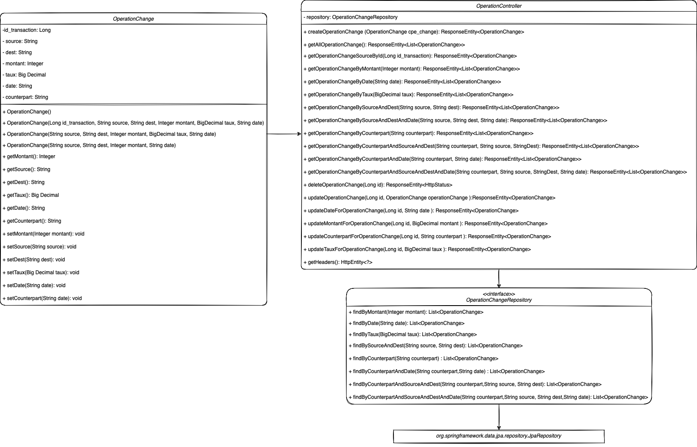

# Microservices - Operation Change

## Presentation
Gerer les operations de change. Une opération de change se caractérise par {"id transaction": 12345, "devise source": "EUR", "devise destination": "USD",
"montant": 1000, "date": "2021-05-25", "taux": 1.22} signifiant qu'en date du 25 mai 2021, une opération de change, identifiée par le numéro 12345, de 1000 euros
en dollard US a été réalisée au taux EUR/USD = 1.22.

## Diagramme de classe

## Methods

| Methods   | Urls                                                      | Actions                                                    |
| :--------:|:----------------------------------------------------------| :----------------------------------------------------------|
| POST      | /operation-change                                         | create new Operation Change                                |
| GET       | /operation-change                                         | retrieve all Operation Change                              |
| GET       | /operation-change/id/{id_transaction}                     | retrieve Operation Change by {id_transaction}              |
| GET       | /operation-change/montant/{montant}                       | retrieve Operation Change by {montant}                     |
| GET       | /operation-change/date/{date}                             | retrieve Operation Change by {date}                        |
| GET       | /operation-change/taux/{taux}                             | retrieve Operation Change by {taux}                        |
| GET       | /operation-change/source/{source}/dest/{dest}             | retrieve Operation Change by {source} and {dest}           |
| GET       | /operation-change/source/{source}/dest/{dest}/date/{date} | retrieve Operation Change by {source} and {dest} and {date}|

# Exemple
## POST
### create new Operation Change
curl -X POST -H "Content-type: application/json" -d "{\"source\" : \"EUR\", \"dest\" : \"USD\", \"montant\" : 500, \"date\": \"2021-06-23\"}" "http://localhost:8080/operation-change"

## GET
### retrieve all Operation Change
curl -X GET "http://localhost:8080/operation-change"
### retrieve Operation Change by {id_transaction}
curl -X GET "http://localhost:8080/operation-change/id/1234"
### retrieve Operation Change by {montant}
curl -X GET "http://localhost:8080/operation-change/montant/1000"
### retrieve Operation Change by {date}
curl -X GET "http://localhost:8080/operation-change/date/2021-06-21"
### retrieve Operation Change by {taux}
curl -X GET "http://localhost:8080/operation-change/taux/132.30"
### retrieve Operation Change by {source} and {dest}
curl -X GET "http://localhost:8080/operation-change/source/EUR/dest/USD"
### retrieve Operation Change by {source} and {dest} and {date}
